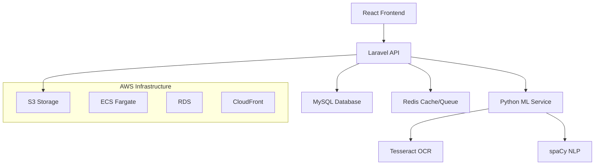

# AI-Powered Telehealth Patient Intake System

A comprehensive telehealth platform that streamlines patient intake and appointment scheduling using AI-powered form processing.

## 🏗️ Architecture Overview



## 🚀 Features

### Patient Portal
- **Secure Authentication**: JWT-based auth with role-based access control
- **Profile Management**: Complete patient demographics and insurance information
- **AI-Powered Intake**: Upload forms (PDF/images) or enter text for automatic data extraction
- **Appointment Scheduling**: Book and manage appointments with healthcare providers
- **Responsive Design**: Mobile-first design with Tailwind CSS

### Provider Portal
- **Dashboard Overview**: Today's schedule and patient intake summaries
- **Patient Management**: View patient records and intake forms with confidence scores
- **Appointment Management**: Manage patient appointments and schedules

### AI Processing Engine
- **Multi-format Support**: Process PDF documents, images (JPEG/PNG), and text input
- **OCR Integration**: Extract text from documents using Tesseract
- **NLP Processing**: Extract structured medical data using spaCy
- **Confidence Scoring**: AI confidence metrics for data quality assessment

### Security & Compliance
- **PHI Protection**: Server-side encryption and private S3 storage
- **Audit Logging**: Comprehensive activity tracking for compliance
- **Rate Limiting**: API throttling and request validation
- **Input Validation**: Multi-layer validation with sanitization

## 🛠️ Technology Stack

### Frontend
- **React 18** with TypeScript and Vite
- **Tailwind CSS** for styling with custom component library
- **React Router** for client-side routing
- **Zustand** for state management
- **React Query** for server state management
- **React Hook Form + Zod** for form validation

### Backend
- **Laravel 10** with PHP 8.2+
- **Laravel Sanctum** for API authentication
- **MySQL/PostgreSQL** for primary database
- **Redis** for caching and queue management
- **AWS S3** for secure file storage

### ML Service
- **Python 3.11** with FastAPI
- **Tesseract OCR** for text extraction
- **spaCy** for natural language processing
- **Pydantic** for data validation

### Infrastructure
- **Docker** with docker-compose for local development
- **AWS ECS Fargate** for container orchestration
- **CloudFront** for CDN
- **Terraform** for Infrastructure as Code
- **GitHub Actions** for CI/CD

## 🚦 Quick Start

### Prerequisites
- Docker and Docker Compose
- Node.js 18+ (for local frontend development)
- Python 3.11+ (for local ML service development)
- PHP 8.2+ and Composer (for local backend development)

### Local Development Setup

1. **Clone the repository**
   ```bash
   git clone <repository-url>
   cd AI-Powered-Telehealth-Patient-Intake-System
   ```

2. **Set up environment variables**
   ```bash
   # Backend
   cp backend/.env.example backend/.env
   
   # ML Service
   cp ml-service/.env.example ml-service/.env
   ```

3. **Start all services with Docker Compose**
   ```bash
   docker-compose up -d
   ```

4. **Wait for services to initialize** (first run may take 2-3 minutes)

5. **Access the applications**
   - Frontend: http://localhost:3000
   - Backend API: http://localhost:8000
   - ML Service: http://localhost:8001
   - API Documentation: http://localhost:8000/api/documentation

### Development Commands

```bash
# Install dependencies
npm run setup

# Start development servers
npm run dev

# Run tests
npm run test

# Lint and format
npm run lint

# Build for production
npm run build
```

## 📋 API Reference

### Authentication Endpoints

#### Register Patient
```http
POST /api/v1/auth/register
Content-Type: application/json

{
  "name": "John Doe",
  "email": "john@example.com",
  "password": "password123",
  "password_confirmation": "password123",
  "phone": "+1-555-0123"
}
```

#### Login
```http
POST /api/v1/auth/login
Content-Type: application/json

{
  "email": "john@example.com",
  "password": "password123"
}
```

### Patient Endpoints

#### Get Patient Profile
```http
GET /api/v1/patients/me
Authorization: Bearer {token}
```

#### Update Patient Profile
```http
PATCH /api/v1/patients/me
Authorization: Bearer {token}
Content-Type: application/json

{
  "dob": "1990-01-01",
  "gender": "male",
  "insurance_provider": "Aetna",
  "emergency_contact": {
    "name": "Jane Doe",
    "phone": "+1-555-0124"
  }
}
```

### Intake Form Endpoints

#### Upload Intake Form
```http
POST /api/v1/intake
Authorization: Bearer {token}
Content-Type: multipart/form-data

file: [PDF or image file]
source_type: "pdf" | "image" | "text"
```

#### Text Intake Form
```http
POST /api/v1/intake
Authorization: Bearer {token}
Content-Type: application/json

{
  "text": "Patient: Jane Doe, DOB: 1990-05-01, Symptoms: headache, nausea",
  "source_type": "text"
}
```

#### Get Intake Forms
```http
GET /api/v1/intake?status=extracted&patient_id={id}
Authorization: Bearer {token}
```

## 🗃️ Database Schema

### Core Entities

#### Users
- **id**: UUID (Primary Key)
- **name**: Full name
- **email**: Unique email address
- **role**: patient | provider | admin
- **provider_fields**: JSON (specialization, license_number for providers)

#### Patients
- **id**: UUID (Primary Key)
- **user_id**: Foreign Key to Users
- **dob**: Date of birth
- **insurance_provider**: Insurance company
- **emergency_contact**: JSON (name, phone)

#### Appointments
- **id**: UUID (Primary Key)
- **patient_id**: Foreign Key to Patients
- **provider_id**: Foreign Key to Users
- **status**: requested | scheduled | completed | cancelled
- **scheduled_at**: Appointment datetime

#### Intake Forms
- **id**: UUID (Primary Key)
- **patient_id**: Foreign Key to Patients
- **status**: uploaded | processing | extracted | failed
- **source_type**: pdf | image | text
- **extracted_payload**: JSON (AI extracted data)
- **confidence**: Decimal (0.00 to 1.00)

## 🔒 Security Features

### Data Protection
- **Encryption at Rest**: All PHI stored with AES-256 encryption
- **Encryption in Transit**: HTTPS/TLS for all communications
- **Signed URLs**: Temporary access to S3 files
- **Input Validation**: Multi-layer validation and sanitization

### Access Control
- **Role-Based Access**: Patient, Provider, Admin roles
- **JWT Authentication**: Stateless token-based auth
- **API Rate Limiting**: Throttling per user/IP
- **CORS Configuration**: Restricted cross-origin requests

### Compliance
- **Audit Logging**: All actions logged with metadata
- **Data Retention**: Configurable retention policies
- **Privacy Controls**: User data export/deletion
- **HIPAA Considerations**: PHI handling best practices

## 🏥 ML Processing Pipeline

### Supported Formats
- **PDF Documents**: Patient intake forms and medical documents
- **Images**: JPEG, PNG scanned documents
- **Text Input**: Direct text entry for quick intake

### Data Extraction
- **Patient Demographics**: Name, DOB, contact information
- **Medical Information**: Symptoms, medications, allergies
- **Insurance Details**: Provider, member ID
- **Chief Complaint**: Primary reason for visit

### Confidence Scoring
- **High Confidence**: 80%+ (Green badge)
- **Medium Confidence**: 60-79% (Yellow badge)
- **Low Confidence**: <60% (Red badge)

## 🚀 Deployment

### AWS Infrastructure

#### ECS Fargate Deployment
```bash
cd infra/terraform
terraform init
terraform plan
terraform apply
```

#### Services Deployed
- **Frontend**: CloudFront + S3 static hosting
- **Backend**: ECS Fargate with ALB
- **ML Service**: ECS Fargate with internal ALB
- **Database**: RDS MySQL with automated backups
- **Storage**: S3 with server-side encryption

### Environment Configuration

#### Production Environment Variables
```bash
# Laravel Backend
APP_ENV=production
DB_HOST=rds-endpoint
REDIS_HOST=elasticache-endpoint
AWS_BUCKET=prod-telehealth-uploads
ML_SERVICE_URL=https://ml-service-internal-alb

# ML Service
ENVIRONMENT=production
LOG_LEVEL=warning
```

## 🧪 Testing

### Running Tests

```bash
# Frontend tests
cd frontend && npm test

# Backend tests
cd backend && php artisan test

# ML Service tests
cd ml-service && pytest
```

### Test Coverage
- **Frontend**: Component tests, integration tests
- **Backend**: Feature tests, unit tests
- **ML Service**: Unit tests, integration tests
- **E2E**: Playwright end-to-end tests

## 📊 Monitoring & Observability

### Health Checks
- **Frontend**: Service worker health
- **Backend**: `/api/health` endpoint
- **ML Service**: `/health` endpoint
- **Database**: Connection and query health

### Metrics
- **Performance**: Response times, throughput
- **Errors**: Error rates, exception tracking
- **Business**: User registrations, intake forms processed
- **Infrastructure**: Resource utilization

### Logging
- **Structured Logging**: JSON format with correlation IDs
- **Log Levels**: Debug, Info, Warning, Error
- **PII Scrubbing**: Automatic removal of sensitive data
- **Centralized**: CloudWatch Logs aggregation

## 🤝 Contributing

### Development Workflow
1. Fork the repository
2. Create a feature branch
3. Make changes with tests
4. Submit a pull request

### Code Standards
- **Frontend**: ESLint + Prettier
- **Backend**: PSR-12 coding standards
- **ML Service**: Black + isort formatting
- **Git**: Conventional commits

## 📜 License

This project is licensed under the MIT License - see the [LICENSE](LICENSE) file for details.

## 📞 Support

For support and questions:
- **Documentation**: Check this README and inline documentation
- **Issues**: Use GitHub Issues for bug reports
- **Discussions**: Use GitHub Discussions for questions

---

**Built with ❤️ for better healthcare technology**